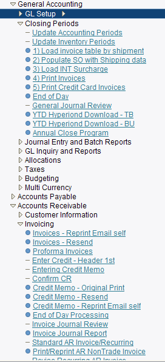
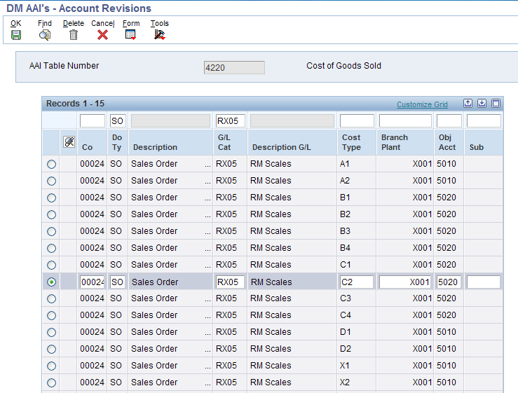
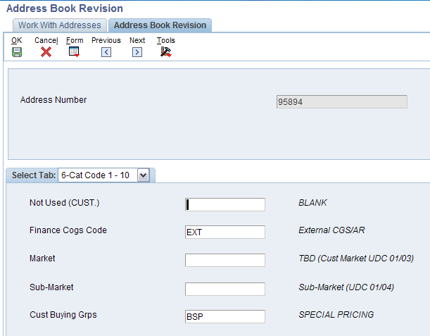
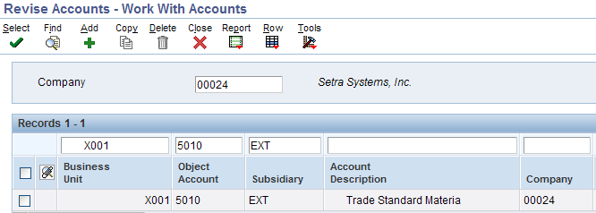
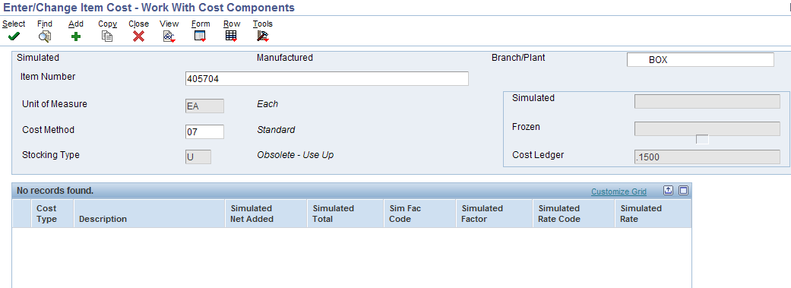
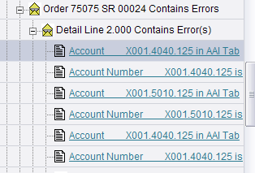
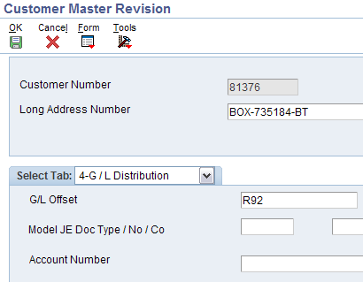
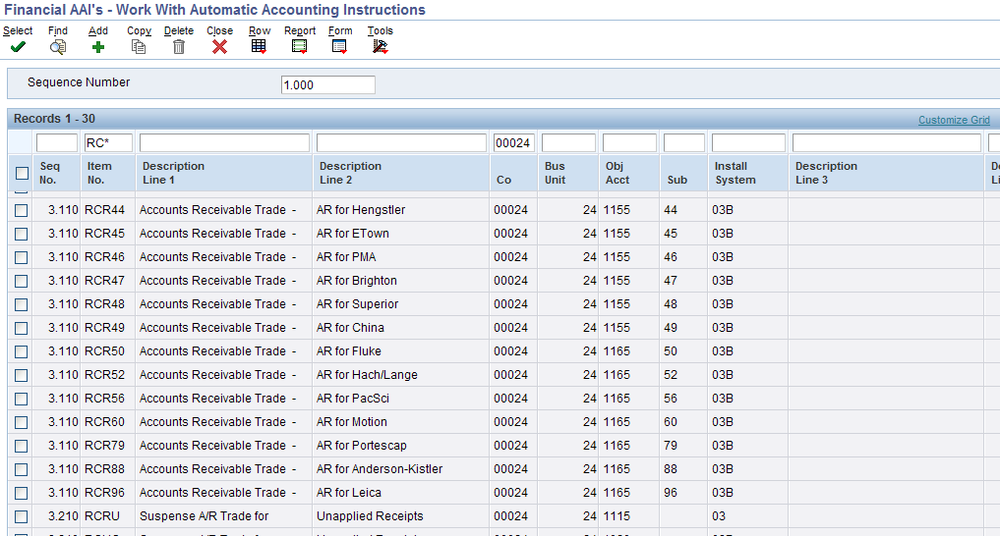
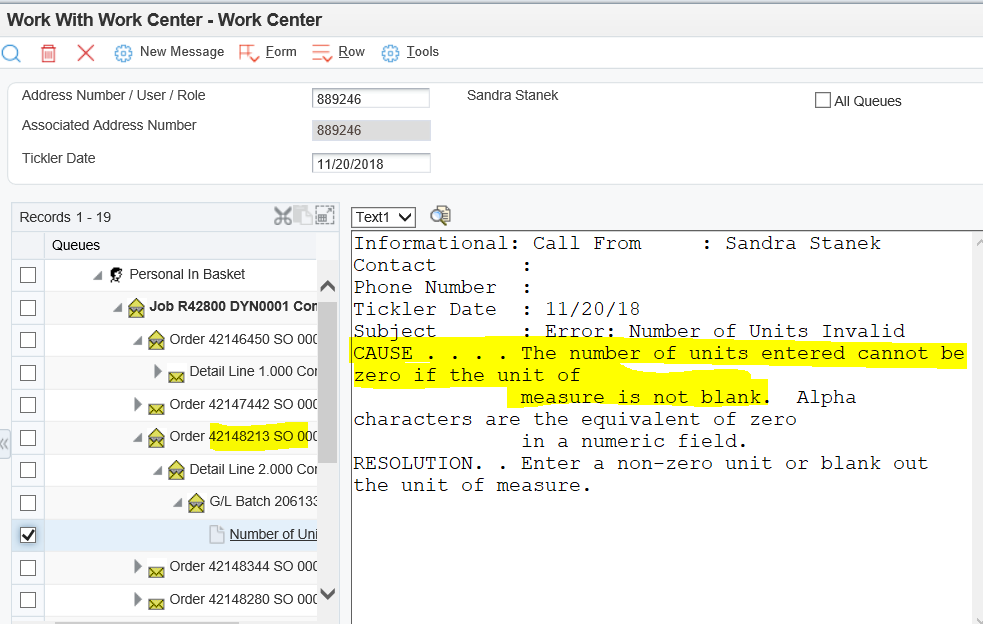

# How to Resolve Sales Update/End of Day Errors

_Note: This document is a continual work in progress… as new errors occur we will update this document to reflect the resolution._

Throughout the month \(and most importantly prior to month end close\) you should verify all invoiced orders are posted to the GL and AR. On occasion there are errors that prevent orders from processing and they need to be manually corrected. To get the most recent errors, run End of Day manually. The details of the errors will appear in your Work Center. End of Day is found on the menu under Closing Periods as well as under Invoicing.

Below is a list of common errors that occur in End of Day processing \(also referred to as Sales Update\) program R42800.

Once you fix the error you can resubmit R42800 and watch the sales orders create the GL records and post to AR or you can wait and have the program run on job scheduler in the evening.

**AAI ERRORS**

_Note: For AAI 4220, the majority of the time the problem is the item on the order has not been through a cost roll._

Cause. . . . . Order Number 24007263, Order Type SO, and Order Company 00024

 contains errors issued by Sales Update \(R42800\).

Resolution . . Please review and correct the errors for this order.

Cause. . . . . The Sales Update program \(R42800\) has found error\(s\) for the

 detail line 1.000.

Resolution . . Please review and correct the error\(s\).

CAUSE : The Automatic Accounting Instruction \(AAI\) number 4220 used by this

 application is not defined in the Distribution/Manufacturing AAI table.

RESOLUTION : Review the AAI that is not set up correctly using the

 Distribution/Manufacturing AAI maintenance application and set

 up or modify the required data.

 Check the information for Company 00024 , Order Type SO and

 GL CLass code RX05 .

1. Is the GL class code a valid value for your company? If not, then you need to go to the sales order line and update the GL class code to a valid value. Please see document “Fixing GL Class Code on Order”. Link below.

[http://sps.jde.dhrscg.net/Project%20Documents/42%20-%20Sales%20Order/Fixing%20GL%20Class%20Code%20on%20Order.docx](http://sps.jde.dhrscg.net/Project%20Documents/42%20-%20Sales%20Order/Fixing%20GL%20Class%20Code%20on%20Order.docx)

1. Go to DMAAI and review AAI 4220, filter on company, order type and GL class code. Does this combination exist?
   1. If it doesn’t exist you will need to add it

* 1. If it does exist move on to next step

1. Go to the order in question. Write down the ship to number and item number for the line in error.
2. Go to the address book and inquire on the ship to. What is category code 2 in the address book showing? In this example the value in category code 2 will be the Sub account portion of the account. So the account the journal entry will hit is X001.5010.EXT. Does the account exist in your Chart of Accounts?

 

1. Go to Enter/Change Item Cost. Inquire on the item. Take row exit to Cost Components. Has a cost roll been done on the item? In this example the item has not been through a cost roll. This is the problem.

**Account Number Invalid**

AAI 4230

CAUSE : The Account Number X001.4040.125 referenced by Distribution AAI Number 4230 is

 invalid. Either this account does not exist or has a posting edit

 code that does not allow manual journal entries.

RESOLUTION : Check the Account Number to verify that it exists and has a

 valid posting endit code for data entry. Change the Distribution

 AAI to reference a valid account or add the missing account

 in the General Ledger system.

CAUSE : The Account Number X001.5010.125 referenced by Distribution AAI Number 4220 is

 invalid. Either this account does not exist or has a posting edit

 code that does not allow manual journal entries.

RESOLUTION : Check the Account Number to verify that it exists and has a

 valid posting endit code for data entry. Change the Distribution

 AAI to reference a valid account or add the missing account

 in the General Ledger system.

CAUSE : The Account Number X001.4040.125 referenced by Distribution AAI Number 4240 is

 invalid. Either this account does not exist or has a posting edit

 code that does not allow manual journal entries.

RESOLUTION : Check the Account Number to verify that it exists and has a

 valid posting endit code for data entry. Change the Distribution

 AAI to reference a valid account or add the missing account

 in the General Ledger system.

1. The 125 portion of the account is probably coming from the address book category code 2 from the ship to on the order.
2. If the 125 is not correct, fix the address book category code 2 to the proper value.
3. If the 125 is correct, go to the chart of accounts and inquire on the account number in error. Does it exist?
   1. If it does not - add it.
   2. If it does - verify it is a posting account.

CAUSE . . . . The RC Automatic Accounting Instruction \(AAI\) for company 00024

 and GL Offset R92 does not exist.

RESOLUTION . Add the missing AAI through the Automatic Accounting Instructions program.

1. Go to the order in question. Write down the sold to number . Go to the customer master to verify the GL offset is correct on the customer.

1. Go to the Financial AAIs and filter on Item No RC\* for your company. Does the sub account 92 exist? In this example it does not. It needs to be added. This will fix the problem.

**Number of Units Invalid**

* Sales order lines with an EA unit of measure with no quantity. Go to Sales Order EDITS and update line to have a quantity of 1. Let customer service know they need to add a 1 going forward.

